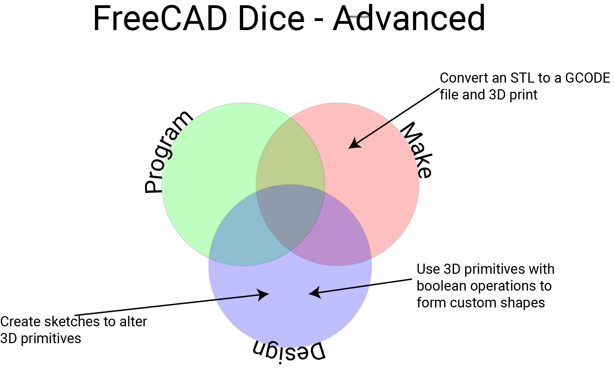

## Introduction

In this project you will design a simple dice using 3D parametric modeling software. If you have access to a 3D printer, you will then print your model.

### What you will make

--- no-print ---

--- /no-print ---

--- print-only ---

--- /print-only ---

--- collapse ---
---
title: What you will learn
---

--- /collapse ---

--- collapse ---
---
title: What you will need
---
### Hardware

+ A computer capable of running FreeCAD

### Software

+ [FreeCAD](https://www.freecadweb.org/)
+ Optional:
    + [Cura](https://ultimaker.com/en/resources/51943-installation-ultimaker-cura) if you need to export your model to a `.gcode` file.
    + [Octopi](https://octoprint.org/download/) for managing your 3D printer.

--- /collapse ---

--- collapse ---
---
title: Additional information for educators
---

If you need to print this project, please use the [printer-friendly version](https://projects.raspberrypi.org/en/projects/project-name/print){:target="_blank"}.

You can [find the solution for this project here](http://rpf.io/p/en/getting-started-freecad-get){:target="_blank"}.

--- /collapse ---
