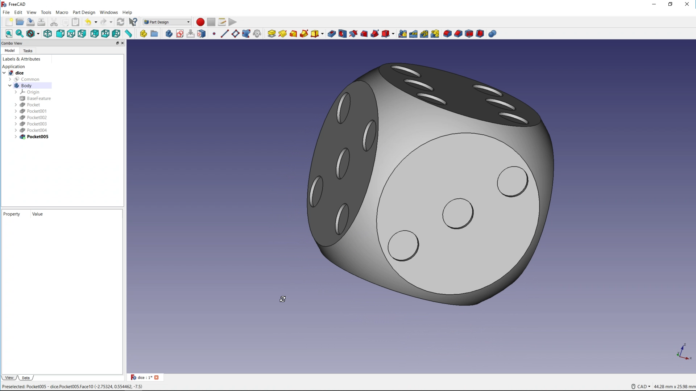

## Introduction

In this project you will be using 3D parametric modelling software to design a simple dice, and then if you have access to a 3D printer, you can print your model.

### What you will make

--- no-print ---

--- /no-print ---

--- print-only ---

--- /print-only ---

--- collapse ---
---
title: What you will need
---
### Hardware

+ A computer capable of running FreeCAD

### Software

+ [FreeCAD](https://www.freecadweb.org/)

--- /collapse ---

--- collapse ---
---
title: What you will learn
---

+ Know how to use basic boolean operations on primitives
+ Know how to create a sketch on a 3d surface
+ Know how to create pockets in a surface from a sketch

--- /collapse ---

--- collapse ---
---
title: Additional information for educators
---

If you need to print this project, please use the [printer-friendly version](https://projects.raspberrypi.org/en/projects/project-name/print){:target="_blank"}.
--- /collapse ---
