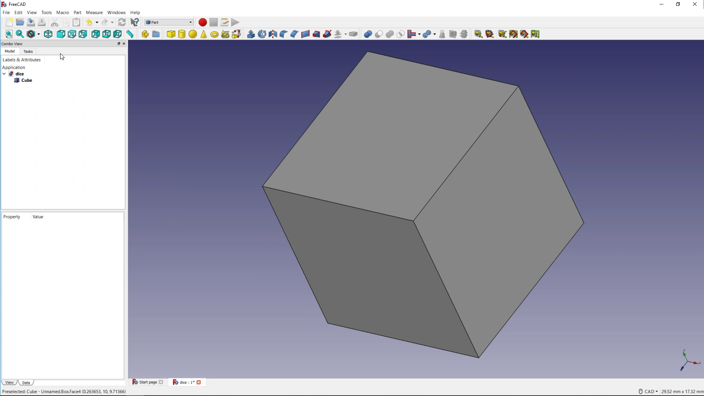
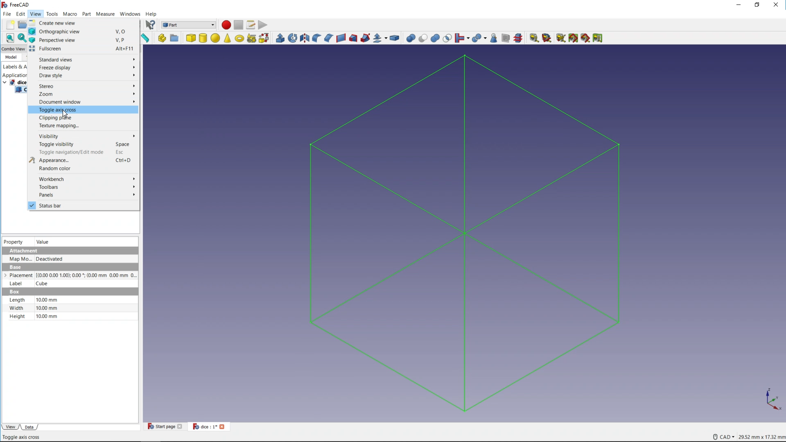
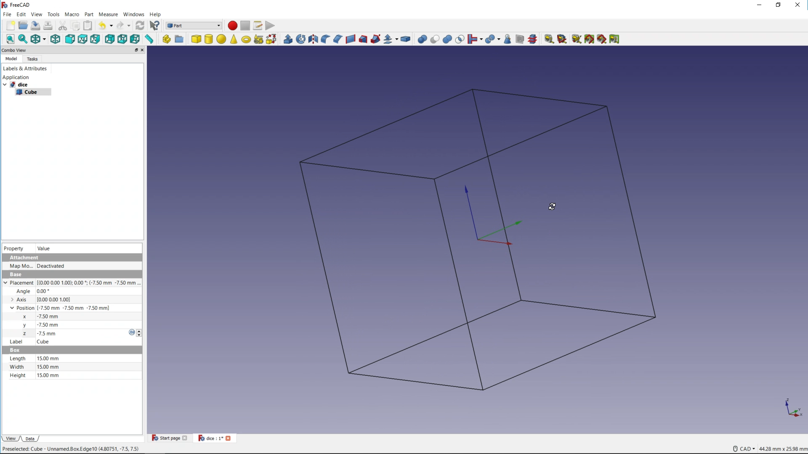

## Modelling a cube

--- task ---
Open FreeCAD from you application menu. You should see a screen that looks like this:


--- /task ---

--- task ---
Click on the *Create a new empty document* icon to get started.


--- /task ---

--- task ---
Click on the *Save the active document* icon and call your file **Dice**


--- /task ---

--- task ---
FreeCAD has many different **Workbenches** each with their own set of tools. To begin with choose the **Part** workbench.


--- /task ---


In the Part Workbench, you have access to [primitive objects](https://en.wikipedia.org/wiki/Geometric_primitive#Common_primitives) such as a cube, a cylinder and a sphere. Theses are 3D objects that you can add to your projects and then edit their parameters.


--- task ---
Click on the Cube icon to add a cube to your file.


--- /task ---

You can change the view of your project using the view icons.


And to manually alter the view you can use:

- `Ctrl` + `right-mouse-button` to move the view
- `Shift` + `right-mouse-button` to rotate the view
- `Ctrl` + `Shift` + `right-mouse-button` to zoom the view

--- no-print ---

--- /no-print ---


The cube is currently 10mm x 10mm x 10mm, which is a little small. It is also not in the centre of the project, so the next task is to edit the cube's parameters.

--- task ---
Click on the *Draw Style* icon


Then select *Wireframe mode* from the context menu.


--- /task ---

--- task ---
Click on **View** and then **Toggle axis cross** to see the projects central axis.


--- /task ---

--- task ---
With the cube selected in the *Labels & Attributes* view, make sure you have selected the *Data* tab at the bottom of the screen. Edit the cubes *Length*, *Width* and *Height*, then edit the *x*, *y* and *z* position of the cube.

```
Position:
	x: -7.5mm
	y: -7.5mm
	z: -7.5mm

Length: 15mm
Width:  15mm
Height: 15mm
```



You should be able to see that the axis cross is now in the centre of the cube.
--- /task ---

