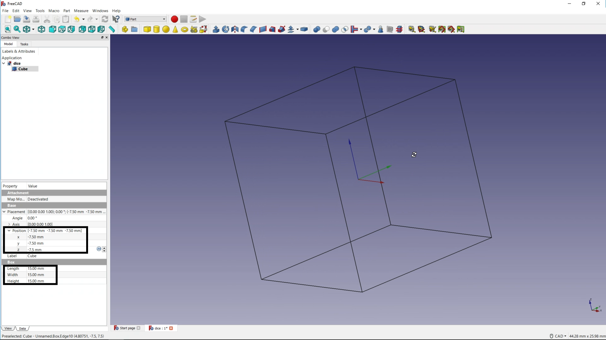

## Model a cube

--- task ---
Open FreeCAD from you application menu. You should see a screen that looks like this:


--- /task ---

--- task ---
Click on the **Create a new empty document** icon to get started.


--- /task ---

--- task ---
Click on the **Save the active document** icon. Name the file you save `Dice`.


--- /task ---

--- task ---
FreeCAD has many different **Workbenches**, each with its own set of tools.

To begin, choose the **Part** workbench.


--- /task ---

In the **Part** workbench, you have access to [primitive objects](https://en.wikipedia.org/wiki/Geometric_primitive#Common_primitives) such as a cube, a cylinder, and a sphere. These are 3D objects that you can add to your project and then edit.


--- task ---
Click on the **Cube** icon to add a cube to your project.


--- /task ---

You can change the view of your project using the **view** icons.


To manually alter the view, use:

- <kbd>Ctrl</kbd> + right mouse button to move the view
- <kbd>Shift</kbd> + right mouse button to rotate the view
- <kbd>Ctrl</kbd> + <kbd>Shift</kbd> + right mouse button to zoom the view

--- no-print ---

--- /no-print ---

The cube is currently 10mm × 10mm × 10mm, so it's a bit too small. The cube is also not in the centre of the project.

Your next task is to edit the cube's parameters.

--- task ---
Click on the **Draw Style** icon.


Then click on the **Wireframe mode** icon in the left-hand menu.


--- /task ---

--- task ---
Click on **View** and then **Toggle axis cross** to see the project's central axis.


--- /task ---

--- task ---
With the cube selected in the **Labels & Attributes** view, make sure you have selected the **Data** tab at the bottom of the screen.

Edit the cube's **Length**, **Width**, and **Height**.

Then edit the cube's **x**, **y**, and **z** position of the cube.

```
Length: 15mm
Width:  15mm
Height: 15mm

Position:
	x: -7.5mm
	y: -7.5mm
	z: -7.5mm
```



You should see that the axis cross is now in the centre of the cube.
--- /task ---

