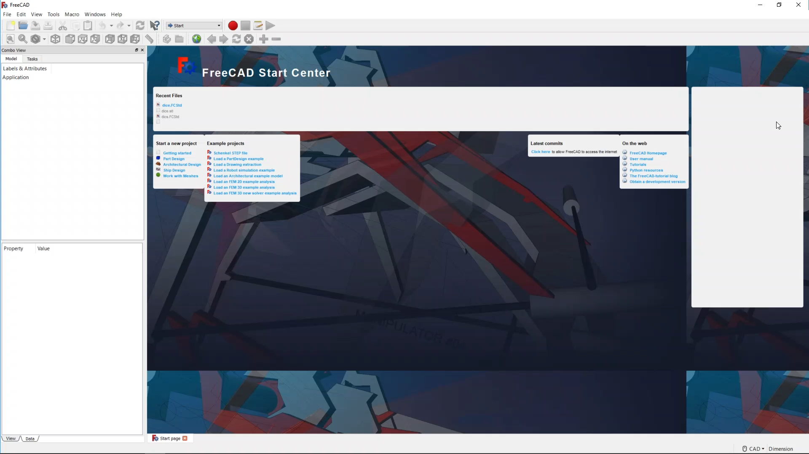
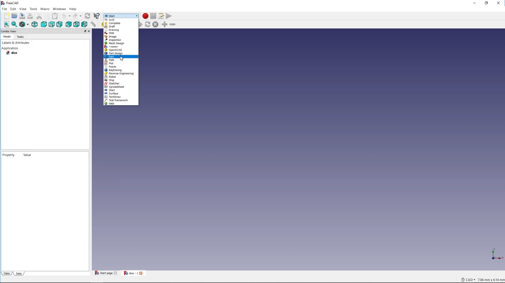

## Step title

--- task ---
Open FreeCAD from you application menu. You should see a screen that looks like this:

--- /task ---

--- task ---
Click on the  icon to create a new document.
--- /task ---

--- task ---
Save your project using the **File** menu and call it **Dice**.
--- /task ---

--- task ---
FreeCAD has many different **Workbenches** each with their own set of tools. To begin with you will use the **Part** workbench.

--- /task ---

--- task ---
In the Part Workbench, you have access to primitive objects such as a cube, a cylinder and a sphere. Theses are 3D objects that you can add to your projects and then edit their parameters.

--- /task ---
