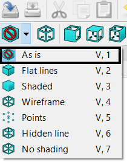

## Round the cube's edges

--- task ---
In the left-hand menu, switch back to the **As is** view.

--- /task ---

--- task ---
Now add a sphere to your project and give it a radius of **10mm**. The sphere should automatically be central with the cube.

--- /task ---

In the menu bar, there are some icons you can click to do **Boolean operations** on selected objects in you project.

--- task ---
With both the cube and sphere selected, click on the **Make an intersection of two shapes** icon to combine the two shapes into a single object.

--- /task ---

Now you have the overall 3D shape of the dice.
