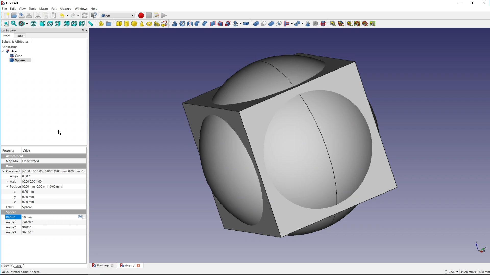
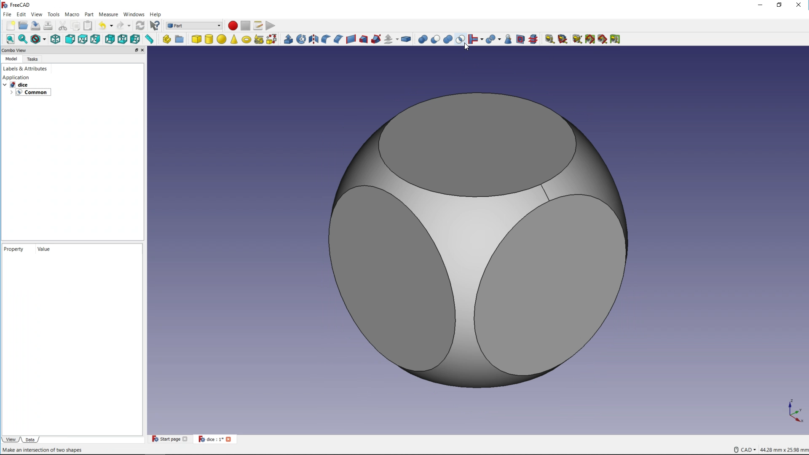

## Rounding the cube

--- task ---
Now add a sphere to your project and give it a radius of **10mm**. It should automatically be central with the cube.

--- /task ---

In the menu bar, you should see some icons that allow you to do **Boolean operations** on selected objects in you project.

--- task ---
With the cube and sphere both selected, use the *Make an intersection of two shapes* icon to combine them both into a single object.

--- /task ---

Now you have the basic shape for your dice.
