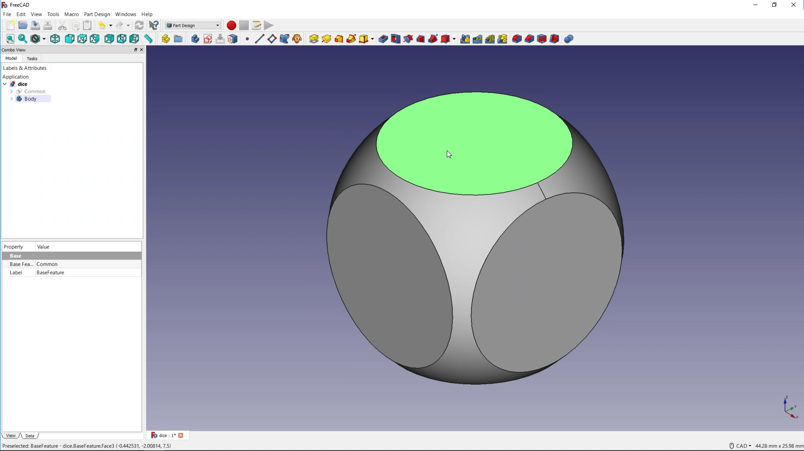
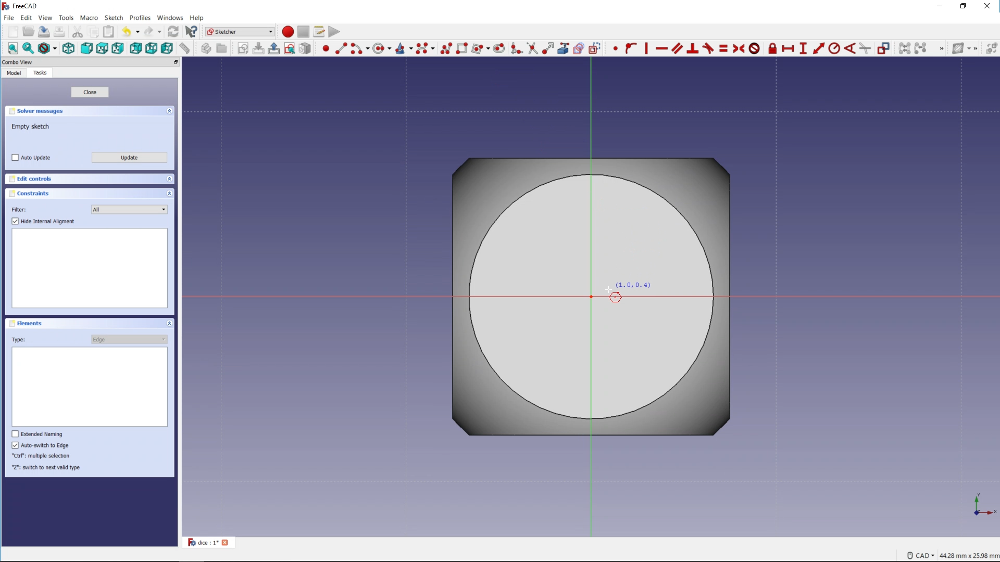
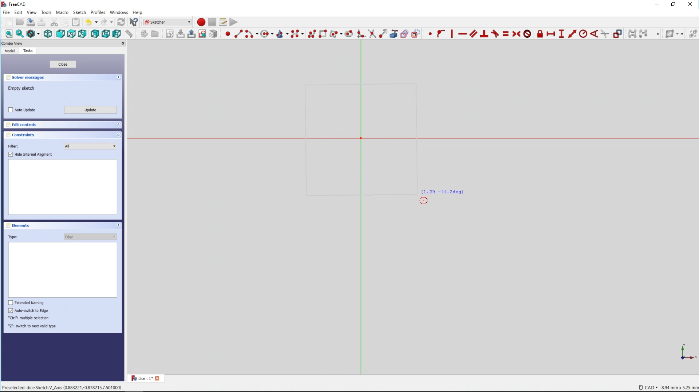
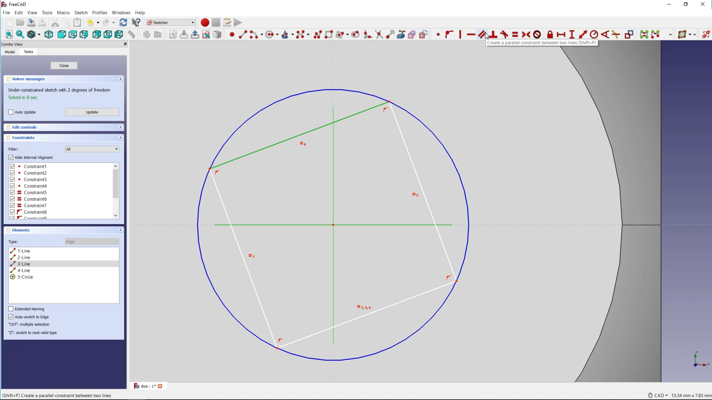
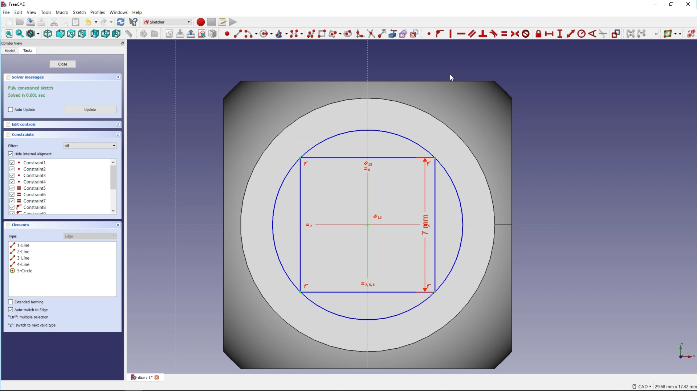

## Adding construction geometry

Now that you have the 3D shape of the dice, it's time to add the pips that represent the numbers.

This can be done by sketching shapes onto the surface of the dice and then creating pockets in the surface.

To do this you are going to need to change which workbench you are using.

--- task ---
Switch to the **Part Design** workbench

--- /task ---

--- task ---
Make sure that your **Common** object is selected in the **Model** tab, and then click on the *Create a new body and make it active* icon.

Clicking on the **Model** tab you should see that your **Common** object is grayed out.

--- /task ---

--- task ---
Next, select the face of the dice that your first set of pips will be added to and then click on the *Create a new sketch* icon.

Your perspective on your dice should change, and you the tab will switch to the **Tasks** tab.

--- /task ---

To make sure that the pips are all placed accurately you will need to create a construction geometry to begin with. This is a little like a guide, helping you to accurately place the remaining sketch.

--- task ---
Click on the drop down arrow next to the *Create a regular polygon in the sketcher* icon.

Then choose the *Create a square by its center and by one corner* icon.

--- /task ---

You can place the square in two ways. The first is to carefully place your cursor over the central dot you can see in the cube and then click and drag out.

The second way is to draw the square anyway, and then use a constraint to place it in the centre of the dice.

--- task ---
Place the square in the centre of the dice by either:

- Carefully clicking on the central dot and then dragging out to draw your square. It can be of any size. Press the **Escape** key so you are no longer drawing squares.

or:

- Draw the square anywhere and of any size. Press the **Escape** key, so you are no longer drawing squares and then click the dot in the centre of the screen and while holding down the **Ctrl** key, click the dot in the centre of the square.

- Now use the *Create a coincident constraint on the selected item* icon to move the square to the centre.

--- /task ---

You'll probably notice that in the **Tasks** tab, there is a message saying that you have an `Under-constrained sketch with 2 degrees of freedom`. If you click on your square and drag an edge around a little, you will see that it can be both rotated and resized. These are the `two degrees of freedom`. You should always make sure that your sketches are fully constrained.

--- task ---
Press the **Esc** key to deselect the current tool you are using.

Click on one of the edges of your square and then click on the horizontal or vertical axis (in red or green). You can then set these two lines to be parallel to each other, using the *Create a parallel constraint between two lines* icon.

This should stop the square from rotating and reduce the number of degrees of freedom to 1.
--- /task ---

--- task ---
Select the right edge of the square and then use the *Fix the vertical distance between two points or line ends* icon, to set the length of the line to **7mm**

You should now see the message in the **Tasks** tab saying `Fully constrained sketch`
--- /task ---

To finish off this section, you can change the square to a construction geometry.

--- task ---
Hold down the **Ctrl** key and select all four lines of the square. Then click on the *Toggles the toolbar or selected geometry to/from construction mode* icon.

The square should turn blue.

--- /task ---
