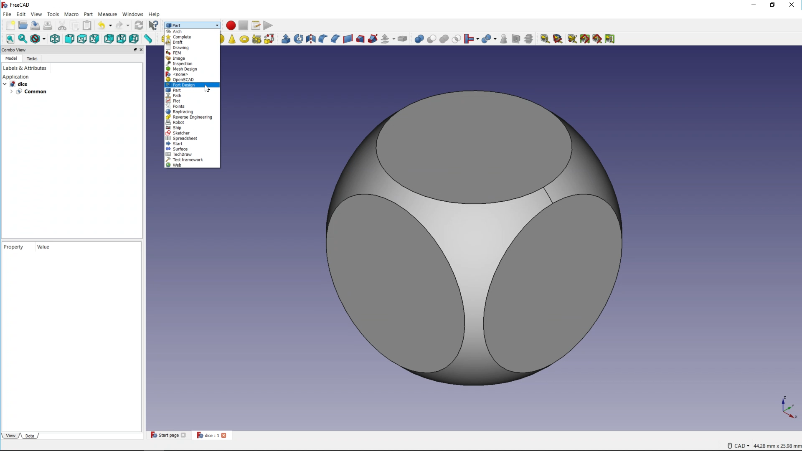

## Add construction geometry

Now that you have the basuc shape of the dice, prepare to add the dots that represent the numbers.

To do this, you will sketch shapes onto the surface of the dice and then create pockets in the surface.

First, you need to change to a different workbench.

--- task ---
Switch to the **Part Design** workbench.

--- /task ---

--- task ---

Make sure that your **Common** object is selected in the **Model** tab.

Then click on the **Create a new body and make it active** icon.

When you click on the **Model** tab, your **Common** object should become grayed out.

--- /task ---

--- task ---

Next, select the face of the dice to which you plan to add the first set of pips. 

Then click on the **Create a new sketch** icon.

Your perspective on your dice should change, and the software should switch to the **Tasks** tab.

--- /task ---

To make sure that the pips are all placed accurately, you need to create a construction geometry next. A construction geometry is like a guide that helps you to accurately place the remaining sketch.

--- task ---

Click on the **drop-down** arrow next to the **Create a regular polygon in the sketcher** icon.

Then click on the ***Create a square by its center and by one corner** icon.

--- /task ---

There are **two** ways to place the square:
* Either place your cursor over the central dot you can see in the cube, and then click and drag outwards
* Or draw the square anywhere, and then use a constraint to place it in the centre of the dice

--- task ---

Place the square in the centre of the dice:

- **Either** carefully click on the central dot and then drag your cursor outwards to draw your square. The square can be of any size. Once you have your square, press the <kbd>Escape</kbd> key so you don't draw any more squares.

- **Or** draw the square of any size somewhere. Then press the <kbd>Escape</kbd> key so you don't draw any more squares. Next, click on the dot in the centre of the screen. Finally, while holding down the <kbd>Ctrl</kbd> key, click the dot in the centre of the square.

- Now click on the **Create a coincident constraint on the selected item** icon to move the square to the centre of the dice.

--- /task ---

In the **Tasks** tab, there is a message saying that you have an "Under-constrained sketch with 2 degrees of freedom".

If you click on your square and drag an edge around a little, you see that you can both **rotate** and **resize** it. Rotation and size are the two degrees of freedom.

You should always make sure that your sketches are fully constrained. This is how you do that for this sketch.

--- task ---

Press the **Esc** key to deselect the current tool you are using.

Click on one of the edges of your square. Then click on the horizontal or vertical axis (in red or green). Then click on the **Create a parallel constraint between two lines** icon to set these two lines to be parallel to each other.

This stops the square from being rotatable and reduces the number of degrees of freedom to 1.
--- /task ---

--- task ---

Click on the right edge of the square to select it. Then click on the **Fix the vertical distance between two points or line ends** icon and set the length of the line to **7mm**.

In the **Tasks** tab, you should now see the message "Fully constrained sketch".
--- /task ---

Now change the square to a construction geometry.

--- task ---

Hold down the <kbd>Ctrl</kbd> key and select all four lines of the square. Then click on the **Toggles the toolbar or selected geometry to/from construction mode** icon.

The square should turn blue.

--- /task ---
