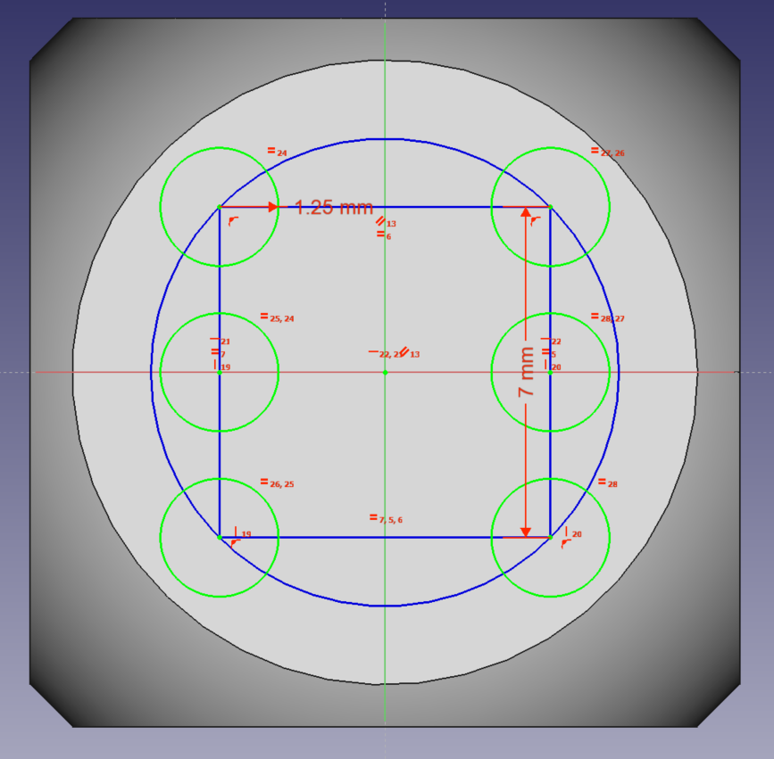

## Adding pips

Now that you have some construction geometry, you can add the pips to the surface of the dice.

--- task ---
Click on the *Create a circle in the Sketcher* icon, and then use this to create six circles, anywhere on the surface of the dice.

--- /task ---

You'll probably notice in the **Tasks** tab that the sketch has a large number of degrees of freedom.

--- task ---
Click the centre of a circle and then hold down **ctrl** and select a corner of the construction geometry. Use the *Create a coincident constraint on the selected item* icon to place the circle at a corner of the square. Repeat this with another three circles..

 

--- /task ---

--- task ---
The remaining two circles can then be aligned vertically with the corners of the construction geometry. Click the centre of one of the circles, then **Ctrl** click the left hand edge of the square. Using the *Create a vertical constraint on the selected item* icon, to align the cirle with the left edge, then repeat this action for the remaining circle and the right edge.

--- /task ---

--- task ---
Then you can align the two middle circles with each other and with the centre of the construction geometry. Click the centre of the square and **Ctrl** click the two circles. Use the *Create a horizontal constraint on the selected item* icon so that all three are horizontally aligned.

--- /task ---

--- task ---
Now set the radius of one of the circles using the *Fix the radius of a circle or an arc* icon.

And set the radius to 1.25mm

--- /task ---

--- task ---
Then use the **Ctrl** key to select all six circles and make them equal in size to each other by using the *Create an equality constraint between two lines or between circles and arcs* icon

All the circles should turn green and the **Tasks** tab should show that the sketch is fully constrained.
--- /task ---

--- task ---
Close the tasks tab to return to the 3D view of your dice. You should see the six circles are visible on one face.
--- /task ---
