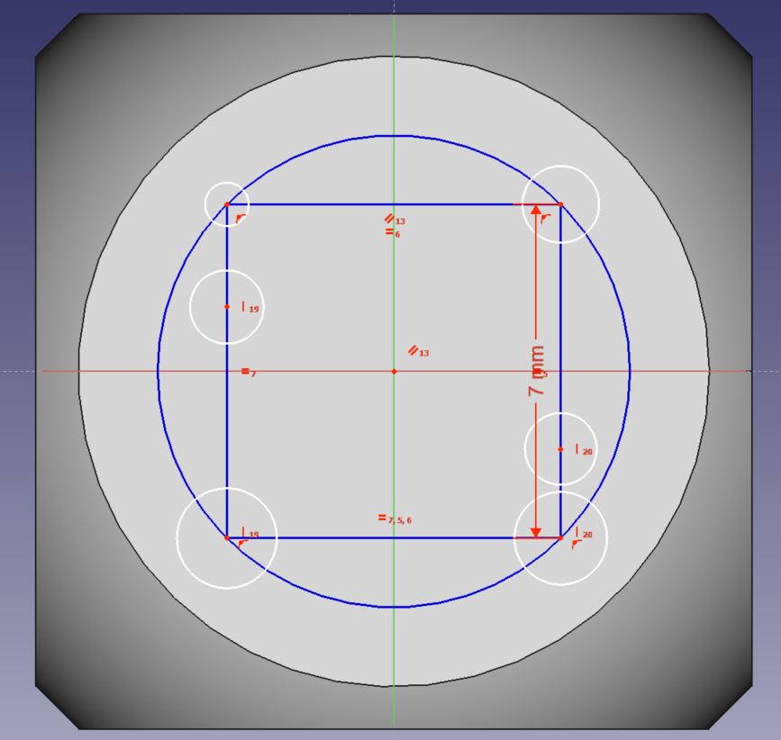

## Draw dots

Now that you have some construction geometry, you can add the dots to the surface of the dice.

--- task ---
Click on the **Create a circle in the Sketcher** icon, and then draw six circles anywhere on the surface.

--- /task ---

In the **Tasks** tab, there is a new message saying that the sketch now has a large number of degrees of freedom.

--- task ---

Click on the centre of a circle. Then hold down the <kbd>Ctrl</kbd> key and click on a corner of the construction geometry. Click on the **Create a coincident constraint on the selected item** icon to place the circle at that corner of the square.

Repeat this with three more circles so there is a circle at each corner.

 

--- /task ---

Then you vertically align the remaining two circles with the corners of the construction geometry.

--- task ---
Click on the centre of one of the circles that's not at a corner. Then hold down the <kbd>Ctrl</kbd> key and click on left edge of the square. Click on the **Create a vertical constraint on the selected item** icon to align the circle with the left edge.

Then repeat this action for the remaining circle and the right edge.

--- /task ---

Now align the two middle circles with each other and with the centre of the construction geometry.

--- task ---
Click on the centre of the square. Then hold down the <kbd>Ctrl</kbd> key and click on the two middle circles. Click on the **Create a horizontal constraint on the selected item** icon to horizontally align all three shapes.

--- /task ---

--- task ---
Now click on the **Fix the radius of a circle or an arc** icon.

Set the radius of one of the circles to 1.25mm.

--- /task ---

--- task ---
Then hold down the <kbd>Ctrl</kbd> key and click on all six circles. Click on the **Create an equality constraint between two lines or between circles and arcs** icon to make the six circles equal in size.

All the circles should turn green, and a message in the **Tasks** tab should tell you that the sketch is fully constrained.
--- /task ---

--- task ---

Close the **Tasks** tab to return to the 3D view of your dice.

You should see the six circles on one side of the dice.
--- /task ---
