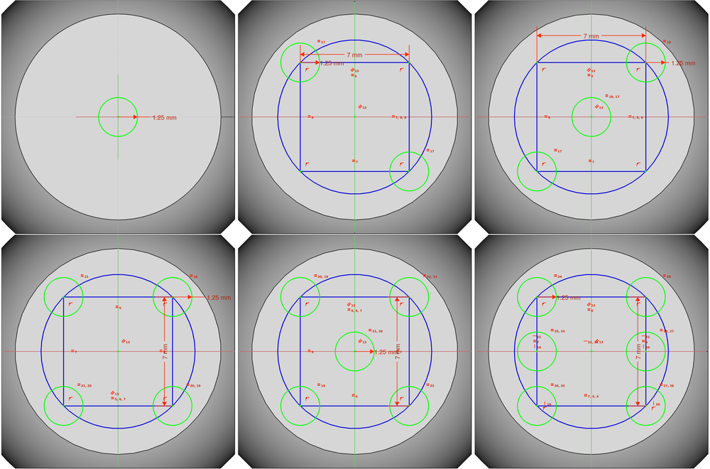

## Create pockets

Now that you have drawn the dots, you need to set them **into the surface** the dice.

--- task ---
Hold down the **Ctrl** key and select all six circles on the surface of the dice.

--- /task ---

--- task ---
Click on the **Create a pocket with the selected sketch** icon to create six pockets in the surface of the dice.

Set the pocket depth to 0.25mm.

--- /task ---

--- task ---
Now you need to add dots to the other faces. Use exactly the same steps:
1. Add construction geometry
1. Draw circles and align them to the geometry
1. Create pockets based on the circles as the dots

--- hints --- --- hint ---
In case you get stuck, here is a video showing you how to add the dots.
VIDEO TO BE INSERTED HERE
--- /hint --- --- /hints ---
--- /task ---

