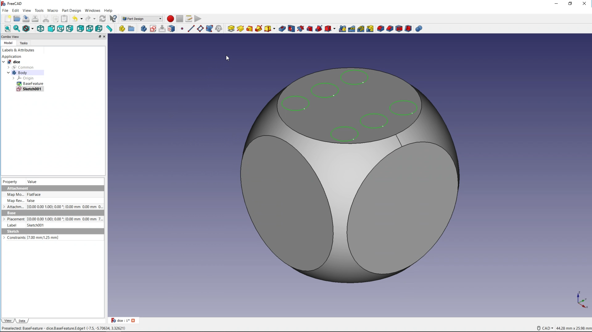
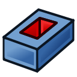
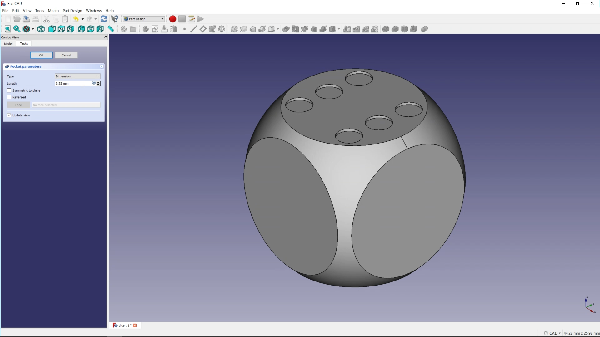

## Creating pockets

Now that yu have drawn the pips, they need to be physically set into the dice.

--- task ---
Hold down the **Ctrl** key and select all six circles on the surface of the dice.

--- /task ---

--- task ---
Use the *Create a pocket with the selected sketch* icon, to create six pockets in the surface of the dice, and set the dept to 0.25mm.

--- /task ---
