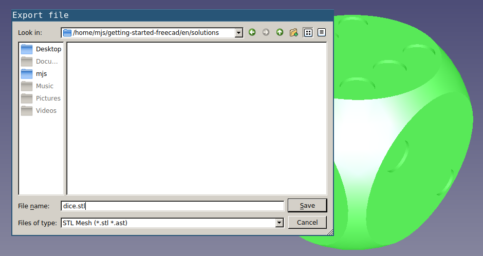

## Exporting your dice

Now it's time to export your model for printing. There are a lot of different types of 3D printer, but most of them will accept `.stl` files or `.gcode` files. You'll probably find it easiest to export as an `.stl` file and then use an external program to slice this into a `.gcode` file.

--- task ---
With the body selected in the **Model** tab, go to **File** > **Export**, then choose the `.stl` option in the **Files of type** dropdown. Give your model a name and then click on save.

--- /task ---

If your 3D printer requires `.gcode` files, then you can use an external application to convert the `.stl`.
