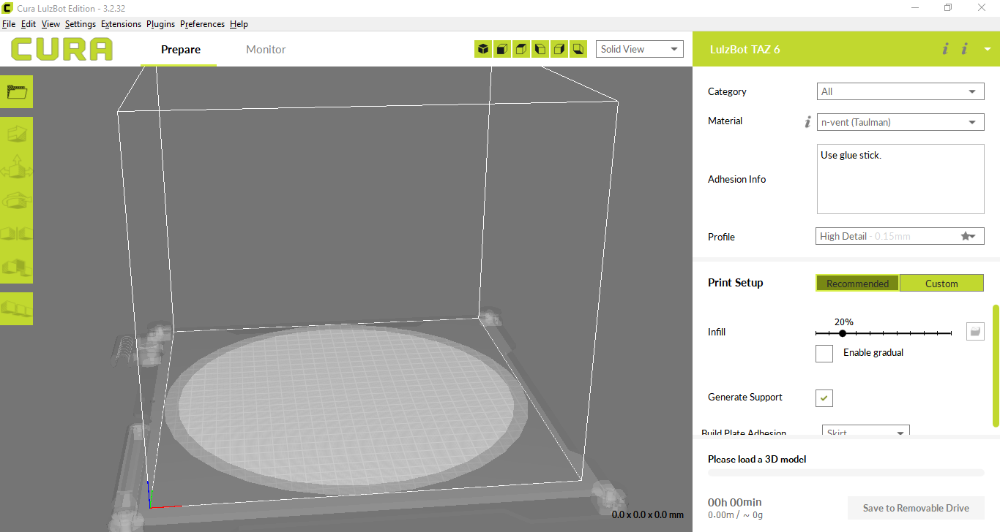
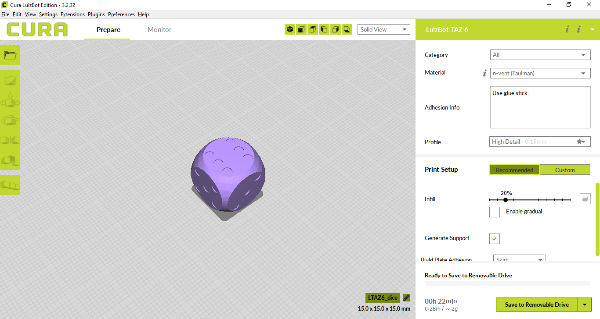
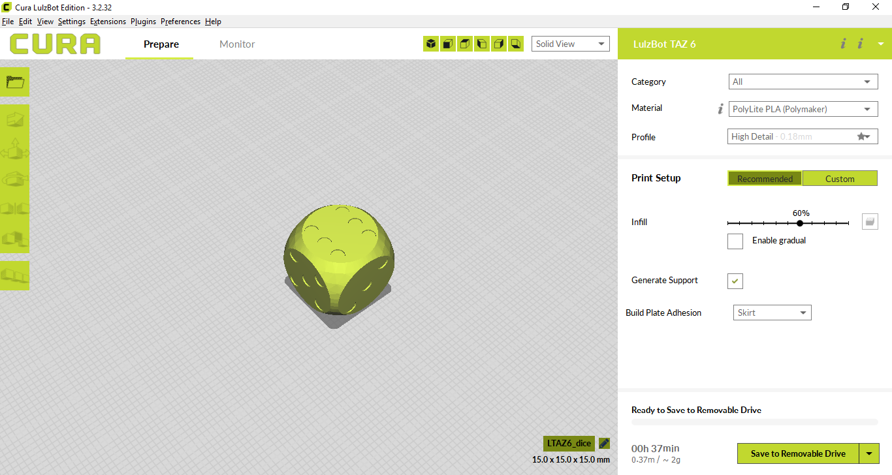

## Exporting your dice

Now it's time to export your model for printing. There are a lot of different types of 3D printer, but most of them will accept `.stl` files or `.gcode` files. You'll probably find it easiest to export as an `.stl` file and then use an external program to slice this into a `.gcode` file.

--- task ---
With the body selected in the **Model** tab, go to **File** > **Export**, then choose the `.stl` option in the **Files of type** dropdown. Give your model a name and then click on save.

--- /task ---

If your 3D printer requires `.gcode` files, then you can use an external application to convert the `.stl`. The instructions below are for [cura](https://ultimaker.com/en/products/ultimaker-cura-software).

--- task ---
Open cura from you application menu.

--- /task ---

--- task ---
Use the **File** menu to open your `dice.stl` file.

--- /task ---

--- task ---
Use the settings on the right hand side, to choose your *material*, *profile*, *infill* and any *support* you might need.
Here the material is PLA, the profile is set to high detail and a 60% infill has been chosen, to give the dice a bit of weight.

Once you are happy with the settings for your 3D printer, you can use the menu in the bottom left to save your `.gcode` file.
--- /task ---
