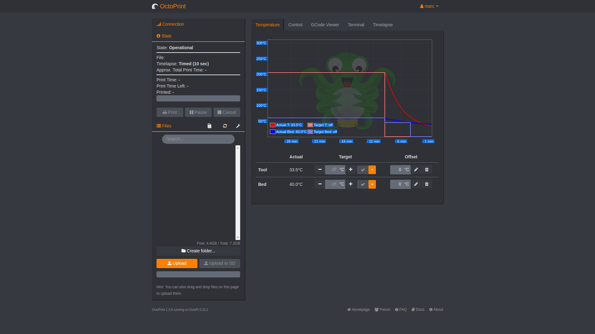
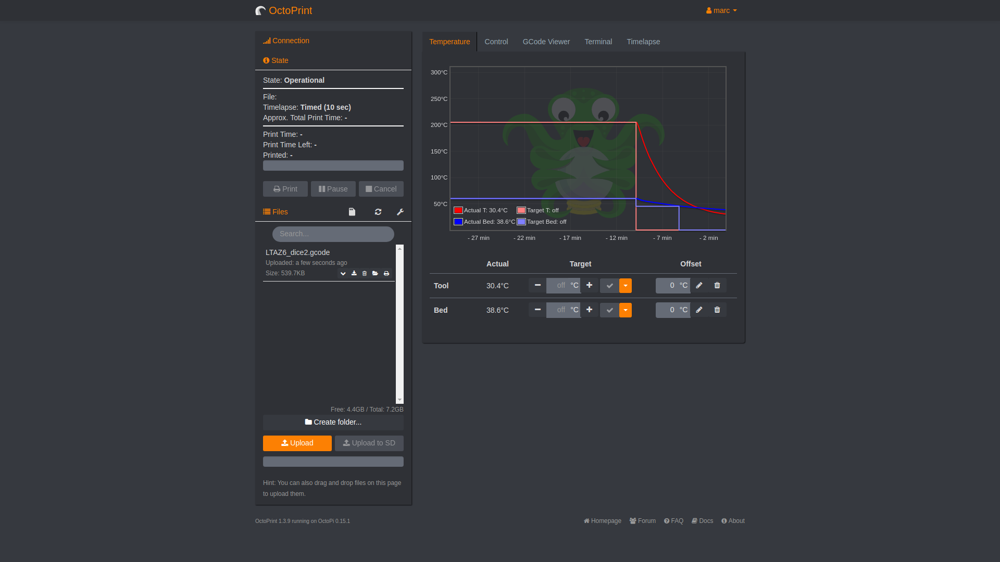
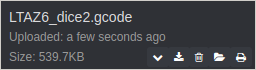
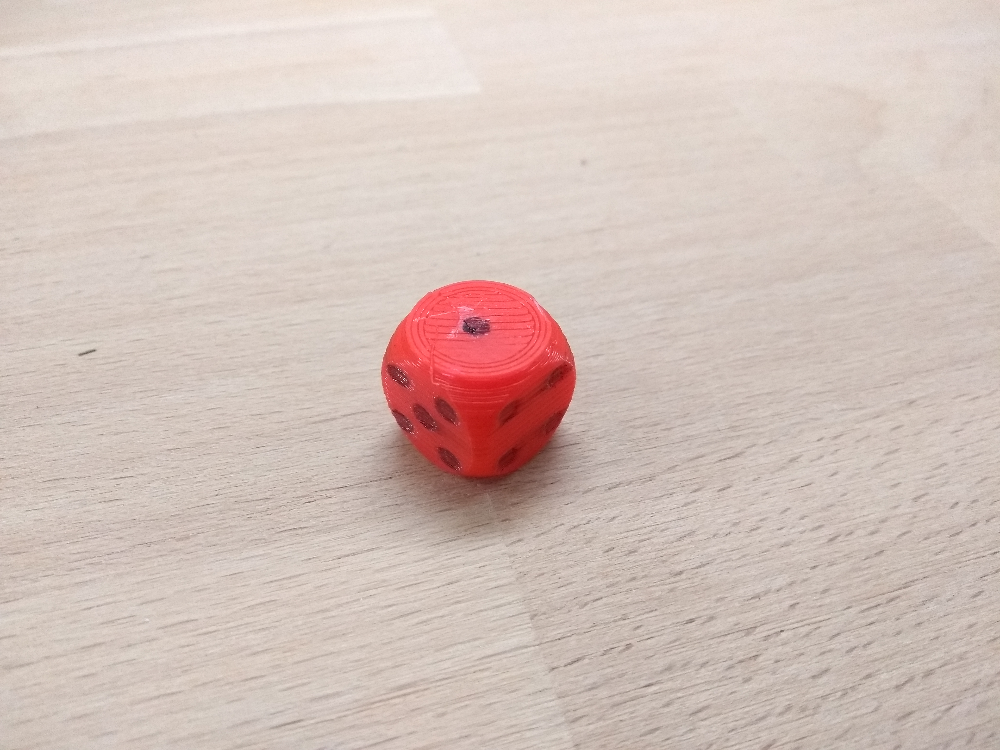
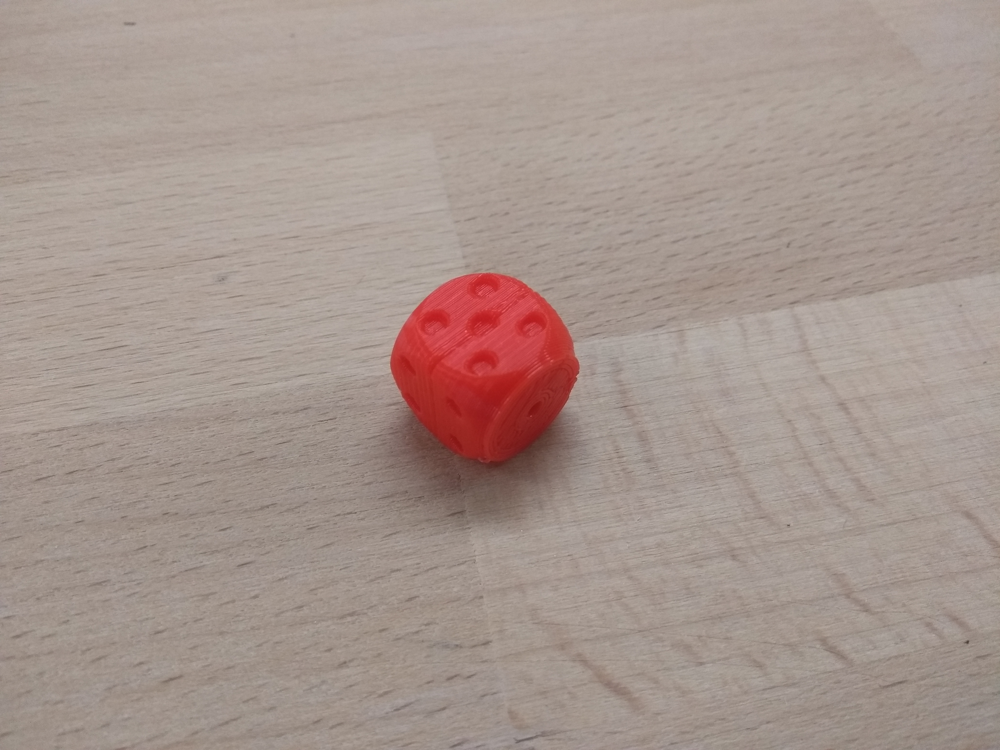

## Printing the dice

Instructions can't be provided for all 3D printers, but the example here uses the [Octoprint](https://octoprint.org/) software to print the dice of a Lulzbot TAZ 6.

--- task ---
Turn on the 3D printer and load the octoprint software.

--- /task ---

--- task ---
Load your `.gcode` file, so it appears it the file list.

--- /task ---

--- task ---
Then load and print the file.

--- /task ---

Your printer should start printing the dice, as soon as it has warmed up.

VIDEO HERE

--- task ---
You may find that the pips are a little faint on the dice. You could set the pocket size on your FreeCAD file to be a little deeper, or simply use a permenant marker to colour in the pips.

--- /task ---
